# System Architecture Diagrams

## 1. Overall Bootloader Architecture


## 2. FSA State Machine

```mermaid
stateDiagram-v2
    [*] --> BootcodeLoading

    BootcodeLoading --> BootcodeExec : SD init success
    BootcodeLoading --> Failure : SD init failed (3 retries)

    BootcodeExec --> StartelfLoading : Bootcode executed

    StartelfLoading --> StartelfExec : Start.elf loaded
    StartelfLoading --> Failure : Load failed (3 retries)

    StartelfExec --> KernelLoading : Hardware initialized

    KernelLoading --> KernelExec : Kernel loaded
    KernelLoading --> Failure : Load failed (3 retries)

    KernelExec --> Success : Kernel handover complete
    KernelExec --> Failure : Handover failed

    Success --> [*] : Boot complete
    Failure --> [*] : Boot failed

    note right of BootcodeLoading : Timeout: 5s
    note right of BootcodeExec : Timeout: 3s
    note right of StartelfLoading : Timeout: 5s
    note right of StartelfExec : Timeout: 10s
    note right of KernelLoading : Timeout: 10s
    note right of KernelExec : Timeout: 5s
```

## 3. FSA Monitor Class Structure


## 4. Driver Hierarchy

```mermaid
classDiagram
    class DriverInterface {
        <<interface>>
        +init()
        +deinit()
        +test()
    }

    class UARTDriver {
        +uart_init()
        +uart_puts(char*)
        +uart_getc()
        -uart_regs_t* regs
    }

    class GPIODriver {
        +gpio_init()
        +gpio_set_function(uint8_t, uint8_t)
        +gpio_set(uint8_t)
        +gpio_clear(uint8_t)
        +gpio_read(uint8_t)
        +gpio_enable_interrupt(uint8_t, uint8_t)
        +gpio_disable_interrupt(uint8_t)
        +gpio_clear_interrupt(uint8_t)
    }

    class TimerDriver {
        +timer_init()
        +timer_get_counter()
        +timer_delay_us(uint32_t)
        +timer_delay_ms(uint32_t)
        +timer_arm_init()
        +timer_arm_set_load(uint32_t)
        +timer_arm_enable_interrupt()
        +timer_arm_clear_interrupt()
    }

    class InterruptController {
        +interrupt_init()
        +interrupt_enable(uint32_t)
        +interrupt_disable(uint32_t)
        +interrupt_register_handler(uint32_t, interrupt_handler_t)
        +interrupt_set_priority(uint32_t, uint8_t)
        +interrupt_set_target(uint32_t, uint8_t)
        -interrupt_handler_t interrupt_handlers[256]
    }

    class MailboxDriver {
        +mailbox_init()
        +mailbox_get_firmware_revision()
        +mailbox_send_message(property_message_t*)
        +mailbox_receive_message(property_message_t*)
    }

    class ClockDriver {
        +clock_init()
        +clock_set_frequency(uint32_t, uint32_t)
        +clock_enable(uint32_t)
        +clock_disable(uint32_t)
    }

    class MemoryManager {
        +memory_init()
        +memory_alloc(size_t)
        +memory_free(void*)
        +memory_get_free()
        +memory_get_used()
        -mem_block_t* heap_start
        -size_t heap_size
    }

    DriverInterface <|.. UARTDriver
    DriverInterface <|.. GPIODriver
    DriverInterface <|.. TimerDriver
    DriverInterface <|.. InterruptController
    DriverInterface <|.. MailboxDriver
    DriverInterface <|.. ClockDriver
    DriverInterface <|.. MemoryManager
```



## 5. BSP Component Relationships


## 6. Safety Interlocks System


## 7. Data Flow Architecture


## 8. Component Interaction Sequence

